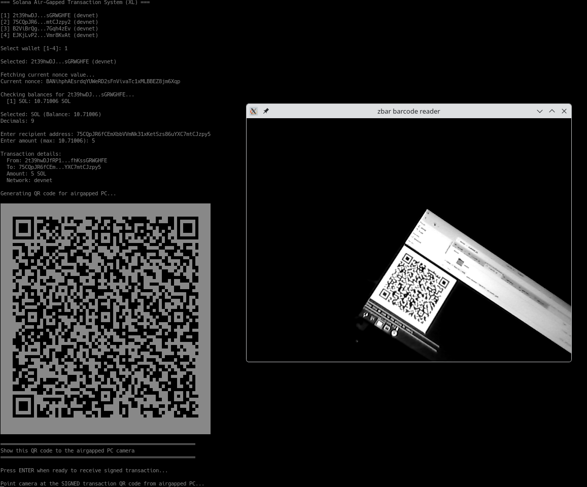

# Solana Air-Gapped Debian Workflow with QR Code Authentication


This screenshot captures the signing process: The air-gapped machine has already received the transaction data, created the cryptographic signature, and generated a QR code. This QR code is about to be scanned by the online machine, which will immediately broadcast the signed transaction to the network.

This project presents a secure, **Bash-based operational framework** for managing Solana digital assets and staking operations through a dual-machine architecture. Private cryptographic keys remain exclusively within the offline environment, with inter-machine communication facilitated entirely through QR code transmission.

## 🔐 Security Architecture

The system operates on the fundamental principle of **Physical Air-Gap Isolation**:

1. **Online Workstation:** Responsible for transaction preparation, nonce retrieval, and broadcasting of signed transaction data to the Solana network.
2. **Air-Gapped Workstation (Offline):** Maintains custody of private cryptographic keys and performs transaction signing operations in an isolated environment.
3. **QR-Bridge Protocol:** Data transmission occurs exclusively through visual encoding using qrencode and zbar-tools, thereby eliminating any potential for digital network exposure. (Note: When scripts are invoked with the --debug flag, data may alternatively be entered manually as plaintext strings for diagnostic purposes.)

## 🛠 System Requirements & Compatibility

**Developed and validated on Debian Trixie and Debian Forky distributions.**

### Requirements for Both Machines:

* **Solana CLI Tools:** Installation instructions available at [Official Solana Installation Guide](https://solana.com/docs/intro/installation) (Note: This URL is subject to change by the Solana Foundation; refer to the main documentation if the link expires.)
* **QR Code Processing Libraries:** zbar-tools, qrencode, bc (available through standard package repositories)


### Additional Requirements for Online Workstation:

* Active internet connectivity to a Solana RPC endpoint (Mainnet or Devnet)
* **Critical:** The ~/.config/solana/id.json wallet must contain a minimal SOL balance sufficient to cover account creation rent-exemption requirements

---

## 📂 System Architecture & File Organization

| Script Name | Execution Environment | Functional Description |
| --- | --- | --- |
| `AIRGAP_1_KEYPAIRS_INIT.sh` | **Offline** | Generates cryptographic keypairs and displays public key via QR code |
| `ONLINE_1_KEYPAIRS_INIT.sh` | **Online** | Provisions on-chain nonce accounts for durable transaction signing |
| `ONLINE_2_TRANSACTIONS.sh` | **Online** | Transaction construction interface for SOL and SPL token operations |
| `AIRGAP_2_TRANSACTIONS_SIGN.sh` | **Offline** | Cryptographic signing module for SOL and SPL token transactions |
| `ONLINE_3_STAKE_INIT.sh` | **Online** | Initializes and funds stake account structures on-chain |
| `ONLINE_4_STAKE.sh` | **Online** | Comprehensive staking management interface (delegation, deactivation, withdrawal, consolidation) |
| `AIRGAP_3_STAKE_SIGN.sh` | **Offline** | Core signing logic for staking-related operations |

---

## 📁 The `./solana/` Directory

Both machines maintain a `./solana/` directory for keypairs and metadata, created automatically by initialization scripts:

**Air-Gapped Machine:**
- **Keypair files:** `PUBKEY.json` format (e.g., `7xKXtg2CW87d97TXJSDpbD5jBkheTqA83TZRuJosgAsU.json`)
- **addresses.json:** Tracks vote accounts and stake accounts associated with each keypair

**Online Machine:**
- **Nonce account files:** `PUBKEY-nonce-NETWORK.json` (e.g., `7xKXtg2CW87d97TXJSDpbD5jBkheTqA83TZRuJosgAsU-nonce-devnet.json`)
- **Stake account files:** `PUBKEY-stake-NETWORK.json` (e.g., `2t39hwDJfRP1atSX6oSuFV4cQwcdAa52fhKssGRWGHFE-stake-devnet.json`)
- **addresses.json:** Tracks vote accounts and stake accounts associated with each keypair

**Filename Syntax:**
- Air-Gapped keypairs: `PUBKEY.json`
- Online nonce accounts: `PUBKEY-nonce-NETWORK.json`
- Online stake accounts: `PUBKEY-stake-NETWORK.json`

**Manual Keypair Import:** You can copy existing keypairs to `./solana/` on the air-gapped machine. The filename **must** match the format `PUBKEY.json` where `PUBKEY` is the Base58-encoded public key. Extract your public key with: `solana-keygen pubkey /path/to/keypair.json`

**Security:** The directory is excluded from git via `.gitignore`. Never transfer the air-gapped `./solana/` directory to the online machine.

---

## 🚀 Phase 1: System Initialization (Establishing the Foundation)

Prior to executing any blockchain transactions, the offline identity must be registered with the Solana network:

1. **Offline Workstation:** Execute `./AIRGAP_1_KEYPAIRS_INIT.sh` to generate your primary wallet infrastructure. Securely document the seed phrase using offline storage methods. The script will display a QR code encoding your **public key**.
2. **Online Workstation:** Execute `./ONLINE_1_KEYPAIRS_INIT.sh`. When prompted, scan the public key QR code from the air-gapped device (alternatively, the key may be entered as plaintext for verification).
3. **Online Workstation:** The initialization script provisions a **durable nonce account**. This cryptographic construct enables offline transaction signing without the typical 60-second expiration constraint imposed by recent blockhashes.

---

## 🤑 Phase 2: Standard Transaction Operations (SOL & SPL Token Transfers)

This workflow facilitates the transfer of native SOL or SPL tokens (e.g., USDC, BONK) while maintaining air-gap security:

1. **Transaction Preparation (Online):** Execute `./ONLINE_2_TRANSACTIONS.sh` and select the appropriate asset type (SOL or SPL token). For token transfers, provide the token mint address. The script automatically derives the **Associated Token Account (ATA)** and generates a "Transaction Proposal" QR code containing the unsigned transaction data.
2. **Cryptographic Signing (Offline):** Execute `./AIRGAP_2_TRANSACTIONS_SIGN.sh` and scan the transaction proposal QR code. The script accesses the locally stored keypair, performs cryptographic signing, and generates a "Signed Transaction" QR code.
3. **Network Broadcast (Online):** Scan the signed transaction QR code back into the online terminal. The script then broadcasts the fully signed transaction to the Solana network for processing.

---

## 💰 Phase 3: Staking Infrastructure & Operations

Once your air-gapped wallet contains SOL, you may proceed with staking operations:

1. **Stake Account Initialization (Online):** Execute `./ONLINE_3_STAKE_INIT.sh`. This provisions the necessary stake account data structure on-chain, with rent-exemption fees paid from your online hot wallet.
2. **Stake Account Funding (Online/Offline):** Execute `./ONLINE_4_STAKE.sh` and select option **[0] Fund stake account**. This generates a transaction QR code to transfer SOL from your air-gapped wallet to the stake account. Sign it with `./AIRGAP_3_STAKE_SIGN.sh` and scan the signed transaction back to broadcast.
3. **Validator Delegation (Online):** Execute `./ONLINE_4_STAKE.sh` and select the **Delegate** operation. Choose your preferred validator and scan the generated QR code.
4. **Delegation Authorization (Offline):** Execute `./AIRGAP_3_STAKE_SIGN.sh` to cryptographically authorize the delegation operation.
5. **Stake Consolidation (Advanced):** Once multiple active stake accounts exist, utilize the **Merge** function within `ONLINE_4_STAKE.sh` to consolidate them into a single account without interrupting reward accumulation. Add a second stake account with `./ONLINE_3_STAKE_INIT.sh --add-stake` to a wallet.

---

## 💎 Advanced Capabilities

* **Durable Nonce Implementation:** Transactions maintain validity indefinitely, accommodating extended QR code scanning procedures without temporal constraints.
* **Multi-Wallet Architecture Support:** The system automatically enumerates and manages all keypairs and nonce accounts located within the `solana/` directory structure.
* **Security-Focused Version Control:** The `.gitignore` configuration is pre-configured to exclude the `solana/` directory, ensuring private cryptographic material is never inadvertently committed to version control systems.

## 🪙 Fee and Rent Payment Responsibility Matrix

| Operation / Script | Transaction Fee Payer | Account Rent Payer | Funding Source |
|--------------------|-----------------|----------------------|----------------|
| ONLINE_1_KEYPAIRS_INIT.sh (Nonce Account Creation) | Online Wallet (id.json) | Online Wallet (id.json) | ~/.config/solana/id.json |
| ONLINE_3_STAKE_INIT.sh (Stake Account) | Online Wallet (id.json) | Online Wallet (id.json) | ~/.config/solana/id.json |
| ONLINE_2_TRANSACTIONS.sh (Asset Transfer) | Air-Gapped Wallet | N/A | Private Key (Air-Gapped) |
| AIRGAP_3_STAKE_SIGN.sh (Staking Operations) | Air-Gapped Wallet | N/A | Private Key (Air-Gapped) |

## ⚠️ Operational Security Protocol for True Air-Gap Implementation

* **Maintain physical custody of seed phrases (with passphrases) using offline storage methods exclusively.**
* **Install Debian Forky on the designated air-gapped device and deploy this script suite. Configure webcam functionality by installing requisite drivers. This network-dependent configuration phase must be completed prior to keypair generation.**
* **Physically remove wireless network hardware (WiFi/Bluetooth modules) from the air-gapped workstation by disassembling the device and extracting the relevant components.**
* **Permanently disable all network connectivity: never connect Ethernet cables, disable USB ports (only if camera still works for QR-scanning) via BIOS configuration, and ensure the device never establishes network connectivity again.**
* **Implement passphrase-protected seed phrases for enhanced cryptographic security.**

## 💸 Testnet Faucet Resources for Development

[https://faucet.solana.com](https://faucet.solana.com) — Devnet SOL allocation

[https://faucet.circle.com](https://faucet.circle.com) — Devnet USDC and EURC allocation

---

## 🐳 Container Architecture (Triple-Container Logic)

To ensure maximum process isolation and environment stability, the framework utilizes a specialized triple-container architecture. Each container is defined as a Systemd Quadlet for automated management.

### 1. The Online Gateway (`solana-online`)
* **Execution Context:** `./online/` directory.
* **Network:** Active internet access for RPC communication.
* **Purpose:** Transaction preparation, nonce retrieval, and network broadcasting.
* **Hardware:** Access to `/dev/video0` for QR scanning.

### 2. The Isolated Air-Gap (`solana-airgap`)
* **Execution Context:** `./airgap/` directory.
* **Network:** **None** (Strict namespace isolation).
* **Purpose:** Cryptographic signing and key management. Private keys remain strictly within this container's mounted `./solana/` volume.
* **Hardware:** Access to `/dev/video0` for QR scanning.

### 3. The Utility Suite (`solana-cli`)
* **Execution Context:** Project Root.
* **Purpose:** Stateless environment for manual CLI operations, debugging, and administrative tasks using the official Solana Tool Suite.

## 📂 Directory & Mount Topology

| Project Directory | Container Mount | Container Role |
| :--- | :--- | :--- |
| `./online/` | `/app` | Online Staging & Broadcast |
| `./airgap/` | `/app` | Offline Signing Vault |
| `./solana/` | `/app/solana` | Shared Metadata (Nonces/Stake info) |
| `~/.config/solana/` | `/root/.config/solana` | Fee Payment Wallet (`id.json`) |

## 🚀 Deployment via Podman/Docker

**Building the Images:**
```bash
# Online Image
cd ./online && podman build -t solana-online .

# Airgap Image
cd ./airgap && podman build -t solana-airgap .
